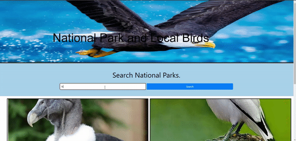

# National Parks and local birds

## Link to page

https://treblotnad.github.io/07-project-1/

## Usage
Landing page shows cool bird pictures with links to birding related websites.  
Search box takes input of a national park. Can be shortened name, as long as string is included in full park name.  
Results page is switched to after confirming park choice, and park info and list of recent bird sightings in the area are displayed.  

## How to use the app 
In order for a user to use our site all they have to do is input a name of a National park they wish to visit or wish to know about its current bird population
Dont worry if you cant remember the full name of the park our code will list out the names of national parks that has that string of characters you have inputted

Once you have chosen your park from our parks modal you will be guided to the parks specific web page. 
Everything propagated here comes from the national parks api from the 

    Name of the Park
    Background image 
    Title of the image
    Credit for the photographer
    The descriptive blurb
    Park Info
    The link to take you to the official national parks web page to learn more about the park. 
The parks api also gives us a latitude and longitude data set. With that we can use the lat and lon with our second api to get any birds spotted around the area within a 25 kilometer radius.
This api will give us 
        
    the name of the bird, 
    the scientific name,
    the amount of times it has been spotted today,
    the time it was most recently spotted,
    and the name of the area it was most recently spotted at.
Every bird box is also a clickable link to a google image search of the bird. 
lastly the website is set up to save past searches to ensure ease of access of the site. Data is stored in local storage and when an entry is first made the name of the park is stored and a button is created to go back to the previously looked at site. If you wish to clear you search history and pressing the clear history button will clear your local storage and any buttons made

## Future Improvements
Some of the main improvements that could be fun to implement are

    Use a third api to look up bird names and have pictures of the birds directly on the web page
    Implement a X button on all recently searched buttons to individually clear local storage and buttons and save ones users want to keep
    Use a fourth api to create a map on the web page and using data from the bird api create a hot zone area to display where on a map birds are spotted more frequent and have images show from the image api

## Special Thanks 
    Thank you to:
    The National Parks Service for allowing us to use their parks API 
    And to the Cornell lab of Ornithology for their api

## Contact information
Github : <https://github.com/Joseortiz0918>
    
Github : <https://github.com/treblotnad>
    
Github : <https://github.com/Pilar1936>

## License
Please refer to the License in the repo.
